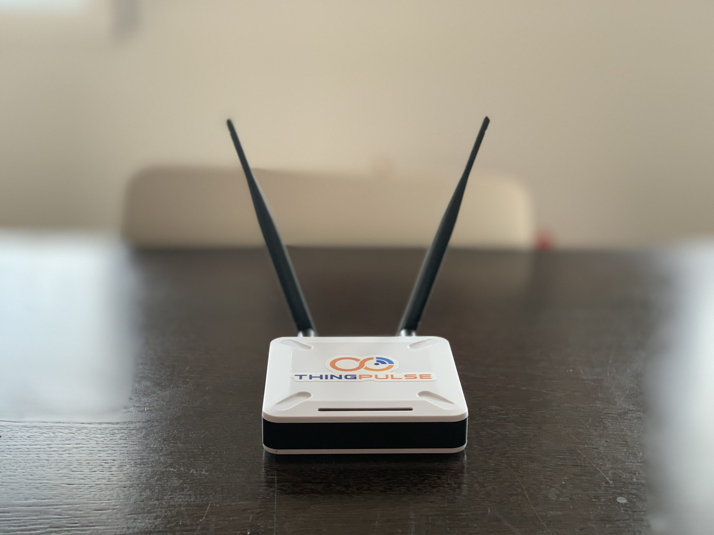
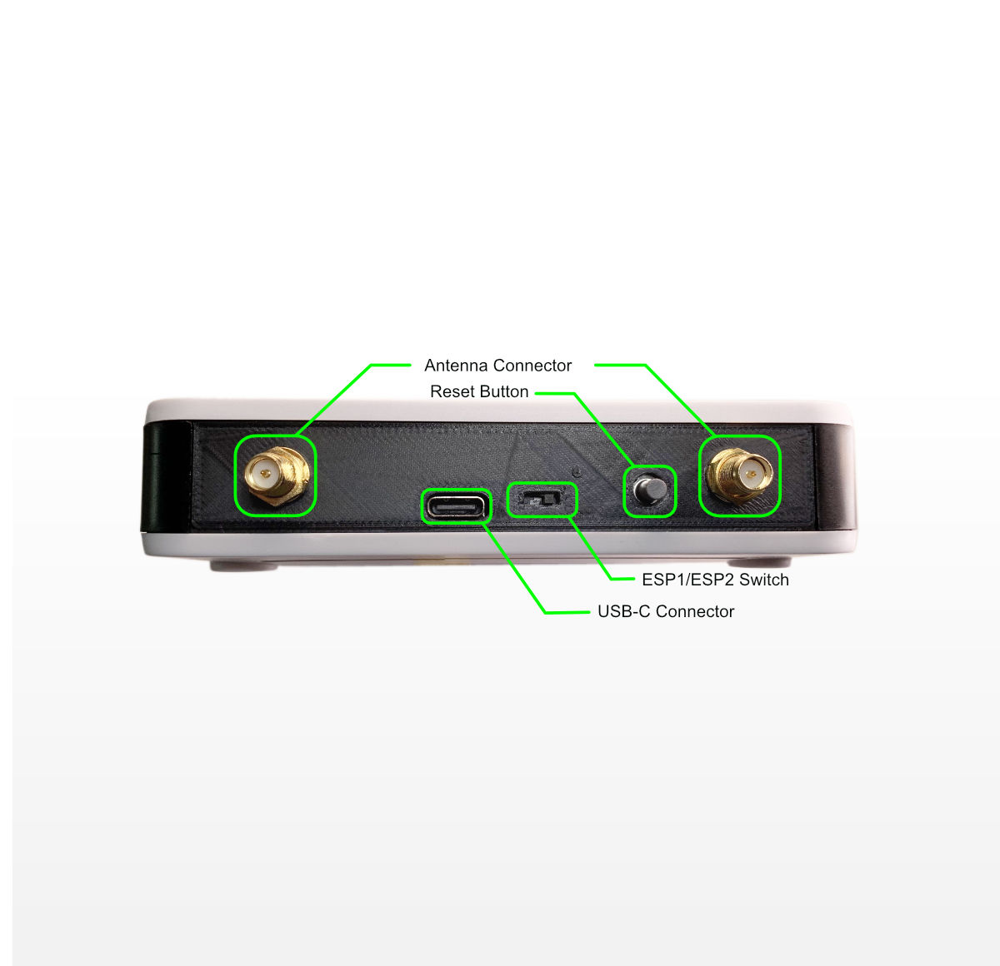

# ESP32-Paxcounter with ThingPulse ESPGateway

This project lets you run the [ESP32-Paxcounter](https://github.com/cyberman54/ESP32-Paxcounter/) project
on the [ThingPulse ESPGateway](https://thingpulse.com/product/espgateway/). The ESPGateway has two
ESP32-WROVER modules and in this project we use one to run the ESP32-Paxcounter and the other one to send 
the collected data over WiFi and MQTT to a server to collect and visualize the statistics.

# Hardware

The ESPGateway has two ESP32-WROVER boards with external WiFi antennas. This lets you independendly
count WiFi and BLE on one ESP32 while sending the collected statistics on the other one.

The two external 2.4GHz 6dBi 50ohm wireless antennas promis far better range for measuring and sending
the data. 

The provided enclosure has holes to place the device on the wall.

# Software

To run the ESP32-Paxcounter on the ESPGateway we need two projects. This project here needs to be flashed
on one of the two ESP32-WROVER modules. Adapt your WiFi and MQTT settings in settings.h

The other ESP32 wrover needs to be flashed with a fork of the ESP32-Paxcounter project. A pull request
has been submitted to the original project. Should this PR get accepted you will be able to use the latest
version of the ESP32-Paxcounter project.

You can choose which ESP32 module to program with a switch on the back of the Gateway. This switch also lets
you choose which ESP32 serial output is visible on your PC.

